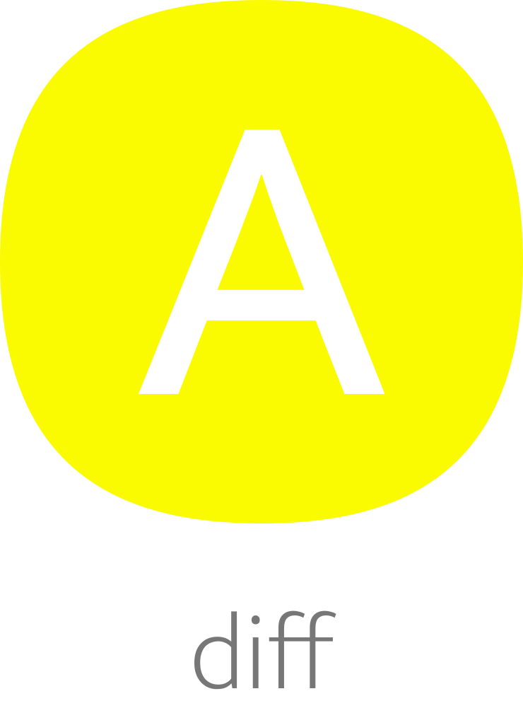

</br>
</br>

<p align='center'>
  <a target='_blank' rel='noopener noreferrer' href='#'>
    
  </a>
</p>

<h1 align='center'>amaui Diff</h1>

<p align='center'>
  Own implementation of The Myers Difference Algorithm
</p>

<br />

<h3 align='center'>
  <sub>MIT license&nbsp;&nbsp;&nbsp;&nbsp;</sub>
  <sub>Production ready&nbsp;&nbsp;&nbsp;&nbsp;</sub>
  <sub>UMD 3.1kb gzipped&nbsp;&nbsp;&nbsp;&nbsp;</sub>
  <sub>100% test cov&nbsp;&nbsp;&nbsp;&nbsp;</sub>
  <sub>Browser and Nodejs</sub>
</h3>

<p align='center'>
    <sub>Very simple code&nbsp;&nbsp;&nbsp;&nbsp;</sub>
    <sub>Modern code&nbsp;&nbsp;&nbsp;&nbsp;</sub>
    <sub>Junior friendly&nbsp;&nbsp;&nbsp;&nbsp;</sub>
    <sub>Typescript&nbsp;&nbsp;&nbsp;&nbsp;</sub>
    <sub>Made with :yellow_heart:</sub>
</p>

<br />

## Getting started

### Add

```sh
yarn add @amaui/diff
```

### Use

```javascript
  import AmauiDiff from '@amaui/diff';

  // Make a new AmauiDiff instance
  // with an optional initial value for options
  const amauiDiff = new AmauiDiff();

  // Diff
  const diff = amauiDiff.diff('aaa', 'aab');

  // {
  //   items: ['r', 2, 'a', 2, 'b']
  // }

  // Update
  amauiDiff.update('aaa', diff);

  // 'aab'
```

### Dev

Install

```sh
yarn
```

Test

```sh
yarn test
```

### Prod

Build

```sh
yarn build
```
